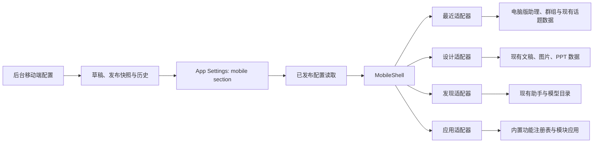

# 手机版四入口体验设计

日期：2026-07-19

状态：设计已确认，等待书面规范复核

## 1. 目标

将现有手机版重组为接近钉钉移动端信息密度的工作入口，同时继续复用 ComHub 已有业务能力。

主界面固定为四个默认入口：

1. 最近
2. 设计
3. 发现
4. 应用

后台管理员可以配置四个底栏槽位的名称、图标、顺序、显隐和站内目标路由。手机版品牌名称可独立配置，留空时继承全站品牌名称。

## 2. 非目标

- 不复制桌面端业务服务或数据库实体。
- 不修改桌面端信息架构、路由或默认页面。
- 不在第一阶段提供任意 SVG、脚本或外部 URL 作为底栏配置。
- 不允许管理员控制用户个人置顶。
- 不新增展示模型、文稿、图片、PPT 或模块应用的业务数据副本。
- 不重写聊天、群组、文稿、图片、PPT、社区或模块应用的核心业务逻辑。

## 3. 已确认决策

- 采用“移动壳层 + 功能适配器”，不直接把桌面页面压缩到手机尺寸，也不建立独立业务系统。
- “最近”使用紧凑统一列表；助理和群组复用电脑版 `home.getSidebarAgentList` 数据，最新话题合并到对应条目。
- 置顶由用户个人控制，并复用电脑版助理和群组的 `pinned` 能力实现账号同步。
- “设计”是创作中心，首屏包含文稿、图片、PPT 快速新建和最近作品。
- “发现”只展示后台精选的推荐助手，首屏固定两行、两列，最多四张助手卡片。
- 推荐助手卡片显示后台配置的展示模型。
- “应用”展示受控内置功能和用户已安装的模块应用。
- 手机版品牌名称是独立覆盖项，未配置时继承全站品牌名称。
- 最终只执行一轮完整浏览器矩阵测试。

## 4. 总体架构



`MobileShell` 只负责：

- 读取和标准化公开移动配置。
- 渲染移动品牌头部、内容出口和底部导航。
- 根据路由计算激活入口。
- 在主入口显示底栏，在聊天、编辑器和详情等深层页面隐藏底栏。
- 在配置不可用时使用编译期默认配置。

每个页面适配器只负责对应域的数据组合和移动展示，不拥有底栏配置，也不复制域服务。

## 5. 路由设计

默认主路由：

| 路由        | 默认入口 | 行为                               |
| ----------- | -------- | ---------------------------------- |
| `/`         | 最近     | 电脑版助理、群组和最近话题统一列表 |
| `/design`   | 设计     | 创作工具和最近作品                 |
| `/discover` | 发现     | 后台精选推荐助手                   |
| `/apps`     | 应用     | 内置功能和已安装模块应用           |

兼容规则：

- 新增的 `/design`、`/discover`、`/apps` 必须注册在 `/:workspaceSlug` 捕获路由之前。
- `/community/*` 继续承载助手、模型、服务商、MCP、Skill 和社区详情页。
- 从“发现”点击助手后进入现有 `/community/agent/:slug` 路由。
- `/agent/*`、`/group/*`、`/page/*`、图片、PPT 和模块应用详情继续使用既有深层路由。
- 深层页面不显示底栏；返回时恢复来源入口、滚动位置和触发元素焦点。
- 后台配置的底栏目标必须是以 `/` 开头的合法站内路径，禁止协议、协议相对地址和脚本 URL。

## 6. 底部导航

系统提供四个稳定配置槽位。槽位 ID 不随名称、图标、顺序或路由变化，便于迁移和恢复默认值。

默认配置：

| 槽位     | 名称 | 图标                  | 路由        | 显示 |
| -------- | ---- | --------------------- | ----------- | ---- |
| `slot-1` | 最近 | `message-square-more` | `/`         | 是   |
| `slot-2` | 设计 | `palette`             | `/design`   | 是   |
| `slot-3` | 发现 | `compass`             | `/discover` | 是   |
| `slot-4` | 应用 | `shapes`              | `/apps`     | 是   |

约束：

- 固定四个槽位，不允许新增第五个槽位。
- 至少两个槽位可见。
- 每个可见槽位的 `order` 必须唯一。
- 中文名称为 1 至 6 个字符；其他文本为 1 至 12 个字符。
- 图标只能来自后台提供的受控 Lucide 图标目录。
- 路由为空、非法或重复时不允许保存。
- 客户端仍会再次标准化配置；无效配置回退到默认四入口。

## 7. 页面设计

### 7.1 最近

页面头部显示手机版品牌名称、品牌 Logo、搜索和新建入口。

内容顺序：

1. 搜索框
2. 置顶列表
3. 最近列表

置顶列表：

- 来源为电脑版助理和群组列表的 `pinned` 字段。
- 支持普通助手会话和 AI 助手群组。
- 长按或更多菜单可置顶、取消置顶。
- 管理员不能指定、覆盖或清除用户置顶。

最近列表：

- 只显示聊天相关记录，不混入文稿和任务。
- 每行显示助手或群组头像、助手或群组名称、最近话题标题、更新时间和群组标识。
- 按最近更新时间倒序排列。
- 同一话题、会话或路由只保留一条记录。
- 置顶项不在普通最近列表中重复出现。
- 群组话题进入既有 `/group/:groupId?topic=:topicId` 路由。

搜索同时匹配助手名称、群组名称和话题标题，只过滤当前已加载结果；完整搜索仍进入现有搜索能力。

### 7.2 设计

快速新建区默认包含三个工具：

- 文稿
- 图片
- PPT

管理员可以修改工具名称、受控图标、顺序和显隐，但工具类型和执行动作仍由受控注册表决定。不得通过自由文本脚本创建新动作。

最近作品区：

- 按更新时间统一展示文稿、图片和 PPT。
- 每项包含类型缩略标识、标题、类型摘要、更新时间和保存状态。
- 点击后进入对应既有编辑页面的移动适配版本。
- 聚合查询只返回引用和展示数据，不复制原始作品内容。

### 7.3 发现

首屏只显示推荐助手，不显示独立模型、服务商、MCP、Skill 或公告栏目。

布局和数据约束：

- 两列、两行，最多四张卡片。
- 后台可以选择 1 至 4 个已发布且可访问的助手。
- 后台可以配置顺序、卡片标题覆盖、描述覆盖和展示模型。
- 展示模型必须从当前可用模型目录选择，并保存 `provider` 与 `model` 标识。
- 卡片显示助手头像、名称、简短描述和“展示模型”标签。
- 助手被删除、下架或失去访问权限时自动跳过，不渲染空卡片。
- 配置不足四项时保持自然空白，不使用占位推荐填充。

### 7.4 应用

页面包含“常用功能”和“我的应用”两个区域。

受控内置功能注册表默认包含：

- 任务
- 知识库
- 助手
- 用量
- 积分
- 模型
- 通知
- 设置

管理员可以配置内置功能的名称、受控图标、顺序、显隐和合法站内路由。

“我的应用”读取用户已安装的模块应用。每项显示应用图标、名称、描述和打开动作。后台可以指定推荐模块应用及顺序，但不能把未发布或用户无权访问的应用强制展示为可执行项。

## 8. 后台移动端页面

新增后台路由 `/settings/admin/mobile`，归属“客户端与集成”导航组，使用 `systemRead` 和 `systemWrite` 权限。

页面分为：

1. 品牌
2. 底部导航
3. 设计入口
4. 推荐助手
5. 应用入口
6. 实时预览

维护能力：

- 表单显示未保存状态。
- 支持恢复系统默认配置。
- 保存前执行客户端结构校验和服务端权威校验。
- 保存只更新草稿；发布后移动端才读取新配置。
- 发布与回滚在事务锁内同时校验已发布 revision 和草稿 revision，避免并发管理员发布未审阅草稿。
- 发布状态、公开兼容镜像和审计记录在同一事务中写入，避免部分成功。
- 保留最近 20 个已发布快照；回滚会创建新的 revision，不改写历史记录。
- 实时预览使用与生产客户端相同的标准化函数和默认值。
- 助手和模型使用选择器，不使用自由文本 ID。
- 图标使用受控图标选择器。
- 路由输入即时显示合法性和重复性错误。

## 9. 配置契约

配置存放在独立的 `mobile` App Settings section 中。`mobile.config.publication` 保存草稿、已发布快照和历史，`mobile.config` 仅作为旧客户端的已发布兼容镜像。两个键都只能通过专用发布接口写入，不能通过通用 App Settings 写入口修改。公开配置采用版本化对象，不并入 `BrandProvider`。

```ts
type MobileIconName = string;

interface MobileNavigationItemV1 {
  icon: MobileIconName;
  id: 'slot-1' | 'slot-2' | 'slot-3' | 'slot-4';
  label: string;
  order: number;
  path: string;
  visible: boolean;
}

interface MobileDesignToolV1 {
  enabled: boolean;
  icon: MobileIconName;
  id: 'document' | 'image' | 'ppt';
  label: string;
  order: number;
}

interface MobileFeaturedAssistantV1 {
  assistantId: string;
  descriptionOverride?: string;
  model: string;
  order: number;
  provider: string;
  titleOverride?: string;
}

interface MobileBuiltinAppV1 {
  enabled: boolean;
  icon: MobileIconName;
  id: string;
  label: string;
  order: number;
  path: string;
}

interface MobilePublicConfigV1 {
  applications: {
    builtins: MobileBuiltinAppV1[];
    featuredModuleAppIds: string[];
  };
  brand: {
    displayName: null | string;
    logoUrl: null | string;
  };
  design: {
    tools: MobileDesignToolV1[];
  };
  discover: {
    assistants: MobileFeaturedAssistantV1[];
    title: string;
  };
  navigation: {
    items: MobileNavigationItemV1[];
  };
  version: 1;
}
```

`MobileIconName` 在 TypeScript 边界可以保持字符串以兼容持久化，但标准化器必须将其限制到共享图标目录中的已知值。

公开读取接口：

```ts
getPublicMobileConfig(): Promise<MobilePublicConfigV1>
getPublicMobileConfigSnapshot(): Promise<MobileConfigRevisionSnapshot>
```

后台通过专用接口读取 publication 状态、保存草稿、发布和回滚。旧公开接口与新版快照接口都以 `publication.published` 为唯一来源；首次迁移时若 publication 不存在，才从旧 `mobile.config` 构建 revision 0。

## 10. 数据组合

### 10.1 最近选择器

纯函数输入：

- 电脑版 `home.getSidebarAgentList` 返回的助理与群组
- 最近 `topic` 类型记录

纯函数输出：

```ts
interface MobileRecentConversationItem {
  avatar?: string;
  id: string;
  kind: 'agent' | 'group';
  pinned: boolean;
  routePath: string;
  title: string;
  topicTitle?: string;
  updatedAt: Date;
}
```

排序规则：

1. 置顶项保持助理优先、群组随后，并按最近更新时间排序。
2. 非置顶项按 `updatedAt` 倒序。
3. 每个助理或群组只显示一条，最新话题合并为 `topicTitle` 并作为非置顶项的进入路由。
4. 没有最近话题的电脑版助理或群组仍显示，并进入自身根路由。

现有 `recent.getAll` 可以增加向后兼容的类型过滤参数，移动端只请求 `topic`，桌面端调用保持不变。

### 10.2 最近作品聚合

新增只读移动聚合查询，返回统一的展示 DTO：

```ts
interface MobileRecentDesignItem {
  id: string;
  kind: 'document' | 'image' | 'ppt';
  routePath: string;
  status?: string;
  title: string;
  updatedAt: Date;
}
```

查询从现有文稿、图片和 PPT 仓储读取最近记录，统一排序后限制数量。聚合层不保存数据，也不改变各域权限规则。

## 11. 加载、空状态和错误处理

所有四个主页面必须提供：

- 与最终布局尺寸一致的加载骨架，避免底栏和列表跳动。
- 明确的空状态和唯一主动作。
- 请求失败状态和重试动作。
- 下拉刷新，不通过刷新整个 SPA 恢复数据。

配置处理：

- 未登录时仍可以读取公开移动配置。
- 配置请求失败时使用编译期默认值，并记录一次可观测错误。
- 未知 `version`、缺失字段、非法图标、非法路径、重复顺序或可见项不足时使用标准化后的安全值。
- 推荐助手或模块应用失效时跳过对应项，其他页面继续可用。
- 某一设计域查询失败时显示该域错误，不阻断其他设计记录。

## 12. 响应式与可访问性

- 支持最小宽度 320px，重点验证 360px、390px 和 430px。
- 底栏高度稳定并包含安全区 `env(safe-area-inset-bottom)`。
- 页面内容预留底栏空间，最后一项不能被底栏遮挡。
- 底栏文本不缩放到不可读；超长配置在保存时阻止，而不是运行时压缩。
- 所有可点击行和图标按钮具备可访问名称和至少 44px 触控区域。
- 长按功能同时提供“更多”菜单路径，保证键盘和辅助技术可访问。
- 焦点样式、焦点恢复、滚动恢复和浏览器返回行为保持可预测。
- 不使用颜色作为群组、置顶或类型的唯一识别方式。
- 动画遵循 `prefers-reduced-motion`。

## 13. 安全与权限

- 后台移动配置读取需要 `systemRead`，写入需要 `systemWrite`。
- 公开接口只返回展示配置，不返回后台权限信息或未发布实体。
- 所有站内路由执行协议、主机、路径和长度校验。
- 图标只保存目录键，不保存 SVG 或 HTML。
- 展示模型必须通过当前模型目录校验。
- 推荐助手和模块应用必须在服务端再次验证发布状态和访问范围。
- 工作空间路由继续使用现有 workspace-aware 导航和权限中间件。

## 14. 迁移与回退

- 现有移动三栏配置不迁移为持久化数据；首次读取直接获得四入口默认值。
- 当前 `/` 会话首页改为新的“最近”适配器，但继续复用 `SessionHydration`。
- 现有 `/community/*` 和 `/me/*` 深层页面保持可访问。
- `/me` 默认不再占用底栏槽位，可由管理员将任意槽位路由配置为 `/me`。
- 配置恢复默认值先进入草稿，发布后写入版本 1 默认对象。
- 若新版移动配置整体不可用，客户端仍能使用编译期四入口默认值完成导航。

## 15. 测试与验收

### 15.1 单元测试

- 移动配置默认值、版本迁移和损坏配置标准化。
- 图标、路径、顺序、显隐数量和文案长度校验。
- 最近列表置顶优先、更新时间排序、群组映射和去重。
- 最近作品三域合并和部分失败处理。
- 推荐助手失效过滤和展示模型校验。
- 内置应用注册表与后台覆盖合并。

### 15.2 组件测试

- 四个主页面的加载、正常、空和失败状态。
- 底栏动态名称、图标、顺序、显隐和激活状态。
- 置顶与取消置顶、重试、下拉刷新和深层导航。
- 后台表单编辑、恢复默认、实时预览、草稿保存、发布冲突、历史回滚和未保存提示。

### 15.3 路由测试

- `/design`、`/discover`、`/apps` 不被 `/:workspaceSlug` 捕获。
- `/community/*`、聊天、群组、编辑器和模块应用详情保持兼容。
- 深层页面隐藏底栏，返回主页面后恢复入口状态。
- 桌面两份路由配置不因移动路由改造产生差异。

### 15.4 浏览器验收

最终只执行一轮矩阵：

- 手机：360x800、390x844、430x932。
- 桌面回归：1280x900。
- 覆盖四个主页面、底栏切换、置顶、群组、设计作品、推荐助手、应用入口、后台配置预览和深层返回。
- 检查横向溢出、底栏遮挡、文本溢出、焦点恢复、滚动恢复、React 警告和页面错误。

## 16. 模块边界

实施时保持以下边界：

- 路由文件只装配 `features`，不承载业务逻辑。
- 移动配置契约、默认值和标准化函数放在共享业务边界，供后台预览和客户端共同使用。
- 四个页面各自拥有独立 feature 目录和测试。
- 最近列表和最近作品的数据组合保持纯函数，可在不渲染 React 的情况下测试。
- 底栏只消费标准化配置，不自行解释后台原始值。
- 后台选择器消费现有助手、模型和模块应用服务，不复制目录实现。

## 17. 完成标准

满足以下条件才视为本阶段完成：

- 四个默认入口在三种手机宽度上可用且无布局遮挡。
- 用户置顶和 AI 群组能正确展示、进入和跨设备同步。
- 设计页可新建并打开文稿、图片和 PPT，可展示最近作品。
- 发现页严格只展示最多四个有效推荐助手及其展示模型。
- 应用页可打开所有可见内置功能和有权限的已安装模块应用。
- 后台可以安全配置移动品牌、四个底栏槽位、设计工具、推荐助手和应用入口。
- 无效或缺失配置不会导致空白页或失去主导航。
- 桌面端行为保持不变。
- 目标测试、类型检查、静态检查和一轮浏览器矩阵全部通过。
