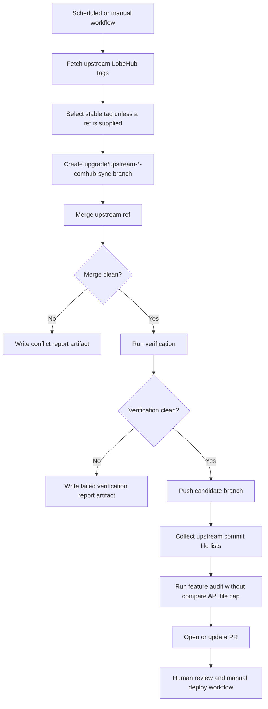

# ComHub Upstream Sync Pipeline

This pipeline upgrades ComHub from upstream LobeHub while preserving ComHub-owned business customizations.

## Goals

- Detect the latest upstream stable release automatically.
- Create an upgrade candidate branch from the current ComHub base branch.
- Merge the upstream tag into that candidate branch.
- Generate a Markdown report with conflicts, changed files, and ComHub customization touches.
- Run focused verification before opening a PR.
- Keep production deployment manual through `.github/workflows/comhub-deploy.yml`.

## Default Upgrade Flow



## GitHub Actions

Workflow: `.github/workflows/comhub-upstream-sync.yml`

Default schedule:

- Every Sunday at `20:00 UTC`.
- Channel: `stable`.
- Base branch: `upgrade/upstream-v2.2.6-comhub-merge`.

Manual inputs:

- `upstream_ref`: specific upstream tag or branch, for example `v2.2.9`.
- `audit_base_ref`: previous upstream tag/ref used by the feature audit, for example `v2.2.6`.
- `channel`: `stable` or `canary` when `upstream_ref` is empty.
- `base_branch`: ComHub branch to upgrade from.
- `open_pr`: whether to open or update a PR when the candidate is clean.

The workflow never deploys production. Production deploy remains controlled by `.github/workflows/comhub-deploy.yml`.

The feature audit deliberately avoids GitHub's compare API file list because that endpoint truncates file data on large comparisons. In CI, the workflow uses local `git rev-list` to enumerate upstream commits, calls the GitHub commit API once per commit, and passes the aggregated file list to `scripts/comhub-upstream-sync/audit.mjs`.

## Local Command

Run from the active source checkout:

```bash
node scripts/comhub-upstream-sync/run.mjs --upstream-ref v2.2.9 --no-verify
```

Useful flags:

- `--channel stable`: auto-detect latest stable upstream tag.
- `--channel canary`: auto-detect latest canary tag for analysis.
- `--upstream-ref v2.2.9`: pin a specific tag or branch.
- `--base-branch upgrade/upstream-v2.2.6-comhub-merge`: choose the ComHub base branch.
- `--candidate-branch upgrade/upstream-v2.2.9-comhub-sync`: override generated branch name.
- `--push`: push the candidate branch to origin.
- `--no-verify`: skip local verification when only producing a merge/conflict report.
- `--skip-fetch`: use already available local refs without fetching upstream.

The script refuses to run on a dirty worktree unless `--allow-dirty` is supplied. Use `--allow-dirty` only in disposable checkouts.

Run the feature audit locally:

```bash
node scripts/comhub-upstream-sync/audit.mjs --base-ref v2.2.6 --upstream-ref v2.2.9
```

When a CI job already has per-commit file data from the GitHub commit API, pass it as either a JSON file path or inline JSON:

```bash
node scripts/comhub-upstream-sync/audit.mjs \
  --base-ref v2.2.6 \
  --upstream-ref v2.2.9 \
  --changed-files-json .tmp/comhub-upstream-sync/upstream-commit-files.json
```

The JSON shape may be an array of commit objects or an object with a `commits` array. Each commit object should include a `files` array with GitHub commit API fields: `filename`, `status`, and optional `previous_filename`.

## Verification

When the merge is clean, the script runs:

```bash
git diff --check HEAD^1..HEAD
node ./node_modules/vitest/vitest.mjs run --silent=passed-only scripts/comhub-upstream-sync/core.test.ts
./node_modules/.bin/tsgo --noEmit
```

On Windows, `tsgo` is executed through `.\\node_modules\\.bin\\tsgo.cmd`.

## Protected ComHub Areas

The sync report compares upstream-changed files against `docs/development/comhub-upstream-customizations.md`.

Pay special attention to:

- AI provider and model pricing configuration.
- Admin-managed provider runtime state.
- Billing, subscriptions, order, and credit ledger logic.
- Admin defaults and user settings synchronization.
- Brand, logo, help menu, community CTA, and about page customizations.
- Database migrations and Drizzle migration journal.
- Production deployment workflow and Baota blue-green scripts.

Every new ComHub customization that touches upstream-owned files must be recorded in `docs/development/comhub-upstream-customizations.md` before merging.

## Failure Handling

### Merge Conflicts

When the workflow reports `merge_status=conflict`:

1. Download the `comhub-upstream-sync-report` artifact.
2. Resolve listed conflict files on the candidate branch.
3. Re-run the focused tests related to touched customization areas.
4. Update `docs/development/comhub-upstream-customizations.md` if new ComHub preservation rules were added.

### Verification Failure

When the merge is clean but verification fails:

1. Open the report artifact.
2. Fix the failed command locally.
3. Re-run the same command before pushing.
4. Re-run the workflow or update the PR branch manually.

## Release Channel Policy

- Use `stable` for production upgrade candidates.
- Use `canary` only for analysis unless a specific upstream canary contains a required fix.
- Do not deploy a canary candidate without a separate manual decision and a rollback plan.
